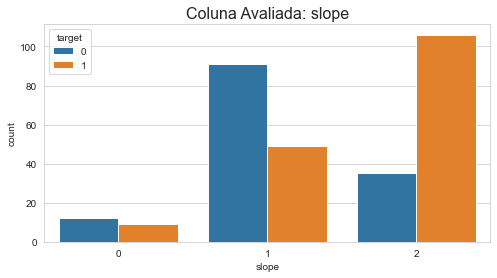

# Projeto de Análise de Dados - Previsão de Doenças Cardíacas

Este projeto de análise de dados tem como objetivo explorar o conjunto de dados sobre doenças cardíacas de 1988, que contém informações de quatro regiões: Cleveland, Hungria, Suíça e Long Beach V. O conjunto de dados possui 76 atributos, com o atributo alvo indicando a presença de doença cardíaca, representado como 0 para ausência e 1 para presença.

## Descrição dos Atributos

O conjunto de dados contém as seguintes características:

1. **Idade (age)**
2. **Sexo (sex)**
3. **Tipo de Dor no Peito (chest pain type)** - Com 4 valores distintos
4. **Pressão Arterial em Repouso (resting blood pressure)**
5. **Colesterol Sérico em mg/dl (serum cholestoral)**
6. **Açúcar no Sangue em Jejum > 120 mg/dl (fasting blood sugar)**
7. **Resultados Eletrocardiográficos em Repouso (resting electrocardiographic results)** - Com valores 0, 1, e 2
8. **Frequência Cardíaca Máxima Atigida (maximum heart rate achieved)**
9. **Angina Induzida por Exercício (exercise induced angina)**
10. **Depressão do Segmento ST Induzida por Exercício em Relação ao Repouso (oldpeak)**
11. **Inclinação do Segmento ST no Pico do Exercício (the slope of the peak exercise ST segment)**
12. **Número de Grandes Vasos Coloridos por Fluoroscopia (number of major vessels)**
13. **Thal: 0 = Normal, 1 = Defeito Fixo, 2 = Defeito Reversível (thal)**

Os nomes e informações pessoais dos pacientes foram removidos e substituídos por valores fictícios, preservando a privacidade.

## Análise de Dados

### Mapa de Calor Principal

Abaixo está o mapa de calor que representa a correlação entre as variáveis. Esse mapa ajuda a identificar quais atributos têm maior impacto na presença de doença cardíaca.

### Variáveis Categóricas

Aqui estão os gráficos ou tabelas que representam as variáveis categóricas. Eles fornecem informações sobre a distribuição de dados nessas categorias.

<table>
  <tr>
    <td></td>
    <td></td>
    <td></td>
  </tr>
  <tr>
    <td></td>
    <td></td>
    <td></td>
  </tr>
  <tr>
    <td></td>
    <td></td>
  </tr>
</table>

### Variáveis numéricas

As representações gráficas ou tabelas das variáveis numéricas estão a seguir:

<table>
  <tr>
    <td></td>
    <td></td>
    <td></td>
  </tr>
  <tr>
    <td></td>
    <td></td>
  </tr>
</table>

## Diferença de Outliers mostradas em Plots

<table>
  <tr>
    <td></td>
  </tr>
  <tr>
    <td></td>
  </tr>
</table>

## Resultados Finais das Métricas

Aqui estão os resultados finais das métricas do modelo de previsão de doenças cardíacas:

### Logistic Regression

### Ada Boost Classifier

### Decision Tree Classifier

### KNeighbors Classifier

### Random Forest Classifier

## Resultados Finais das Métricas - Com Escalonamento

Os resultados finais das métricas após aplicar escalonamento estão disponíveis a seguir:

### Logistic Regression - Scaler

### Ada Boost Classifier - Scaler

### Decision Tree Classifier - Scaler

### KNeighbors Classifier - Scaler

### Random Forest Classifier - Scaler

## Conclusão

Este projeto de análise de dados fornece insights valiosos sobre a previsão de doenças cardíacas com base em um conjunto de dados detalhado. Os resultados e visualizações apresentados aqui podem ser úteis para profissionais da área de ciência de dados que desejam criar modelos de previsão de doenças cardíacas. O conjunto de dados e as análises aqui apresentadas são uma adição valiosa ao seu portfólio de ciência de dados.

### Random Forest Classifier - Scaler

